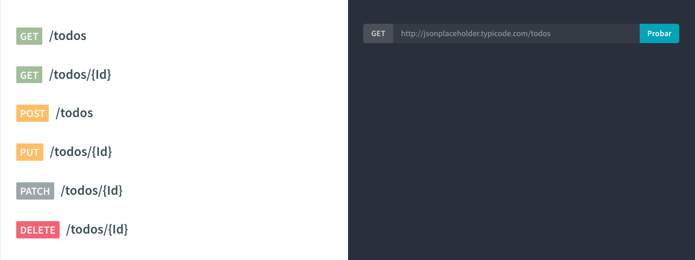
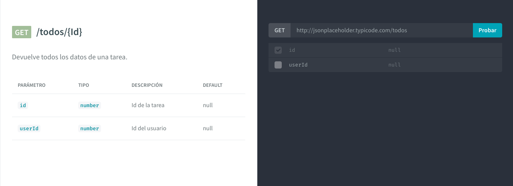

# Api

Este plugin genera una vista para documentar apis.

## Estructura básica

Dado que la vista de documentación de una api, difiere mucho de una normal, requiere de un par etiquetas para que se muestre correctamente:

* `api>`: Debe ser la primera línea del archivo, le dice al plugin que se trata
de una página para documentar apis.

* `apiBlock>`: El diseño divide la página en bloques (filas), esta etiqueta le
dice al plugin que comienza un bloque.

``` markdown
api>

apiBlock>
<!-- Bloque 1 -->

apiBlock>
<!-- Bloque 1 -->

apiBlock>
<!-- Bloque 1 -->

```

## Títulos de los bloques

Dentro de un `ApiBlock` si los títulos comienzan con un método en mayúscula: `GET`, `POST`, `PUT`, `PATCH` or `DELETE`, este se resalta más. También se representan de igual forma en la barra lateral.



``` markdown
## GET /todos
## GET /todos/{Id}
## POST /todos
## PUT /todos/{Id}
## PATCH /todos/{Id}
## DELETE /todos/{Id}
```

## Api Interactiva

Este plugin, permite realizar peticiones reales a nuestra api. Solo se requiere
indicar algunos parámetros de configuración en formato `json`.

> El plugin genera tanto la tabla con los parámetros de la descripción, como el formulario del ejemplo



```demo[markdown]
```apiExample
{
  "url": "http://jsonplaceholder.typicode.com/todos",
  "method": "GET",
  "params": [
    {
      "name": "id",
      "required": true,
      "type": "number",
      "description": "Id de la tarea",
      "default": null    
    },
    {
      "name": "userId",
      "required": false,
      "type": "number",
      "description": "Id del usuario",
      "default": null    
    }
  ]
}
```
```
